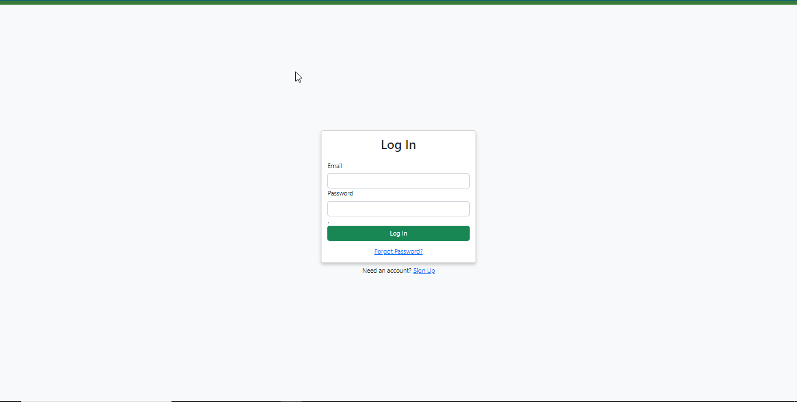
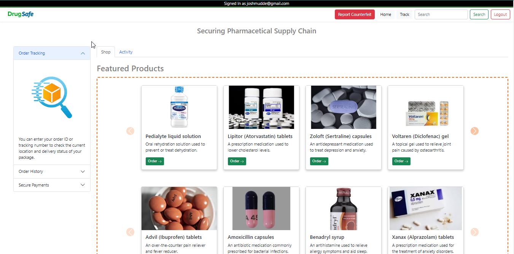
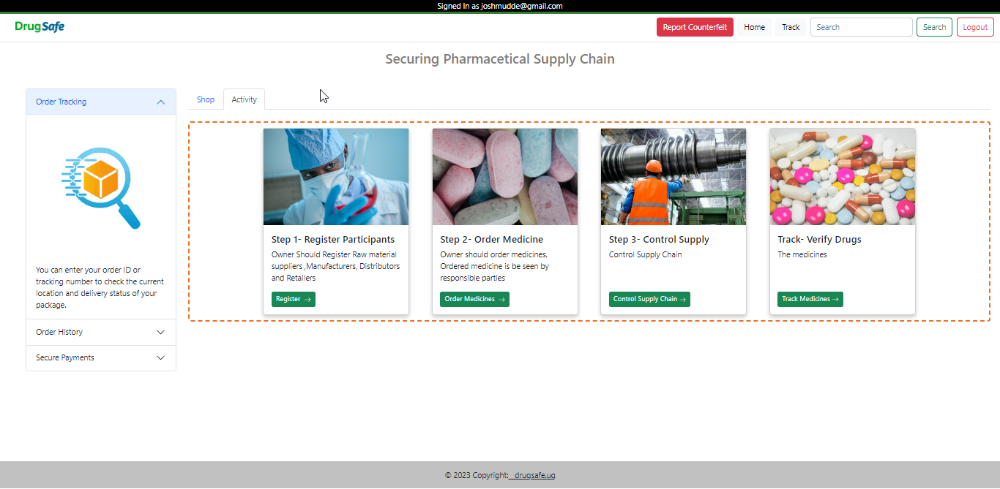
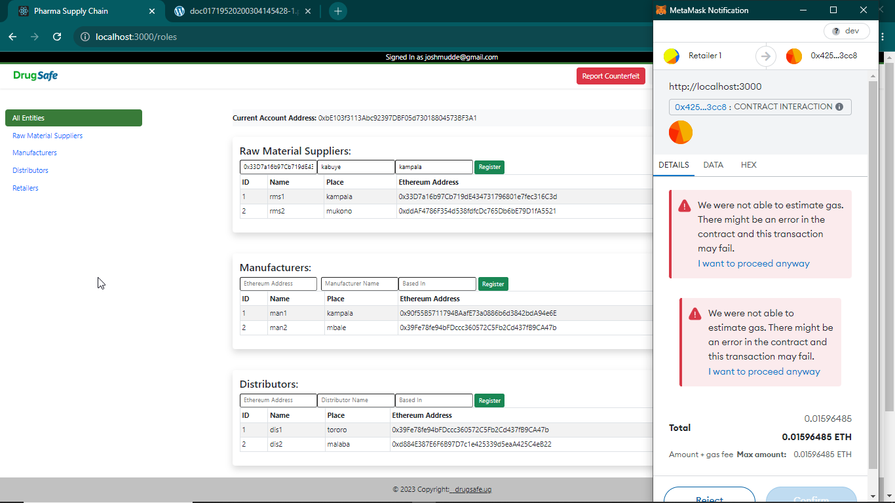
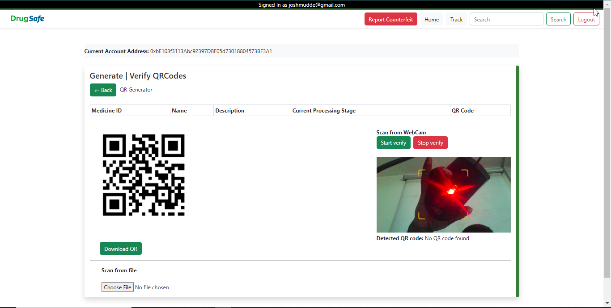
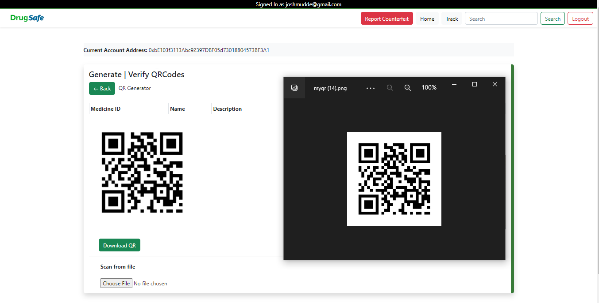
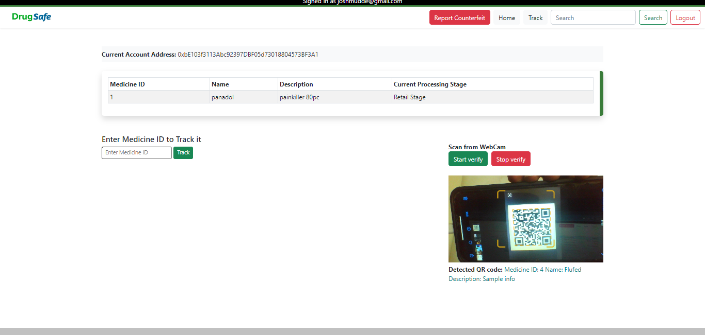

# Simple Supply Chain Simulation

<!-- [Supply chain simulation using blockchain.](https://www.youtube.com/watch?v=2e-NGuT1PnY) -->
## Usage

### Login/SignIn:

Login/SignIn in into the System(Compulsory), Authentication is done through firebase (Check firebase.js)



### Orders drugs:

This is the home screen where the customer views and orders drugs



### Administration activities:

The activities Recorded on the blockchain for verification. (You need to be logged into meta mask to continue) 



### Account Errors:

Only the right blockchain account can do certain operations. Make sure to use the right account If confused checkout youtube



### Generate QR-Code:

Manufacturer can generate QR-Code as well as download them and attach to products



### Donloading Qr-code:

Donloading Qr-code



### Scanning:

Scanning to verify QR-Code on product




## 🔧 Setting up Local Development

### Step 1

Open ganache UI/cli and configure truffle-config.js file. Not required for most cases.

### Step 2

Import the ganache local blockchain accounts in metamask using the mnemonic provided.

### Step 3

Clone the repo

```bash
git clone https://github.com/Muddejosh/Counterfeit-Drug-Detection-and-Prevention-Blockchain-System.git

cd supply-chain-truffle-react
```

### Step 4

Compile and deploy the smart contract

```bash
npx truffle compile
npx truffle migrate
```

> NOTE: If you make changes in the smart contract you have to redeploy it using `npx truffle migrate --reset`

### Step 5

Install `node_modules` using `yarn`

```bash
cd client
yarn
```

Install `node_modules` using `npm`

```bash
cd client
npm install
```

### Step 6

Start the development server using `yarn`

```bash
yarn start
```

Start the development server using `npm`

```bash
npm start
```

The site is now running at `http://localhost:3000`!
Open the source code and start editing!
